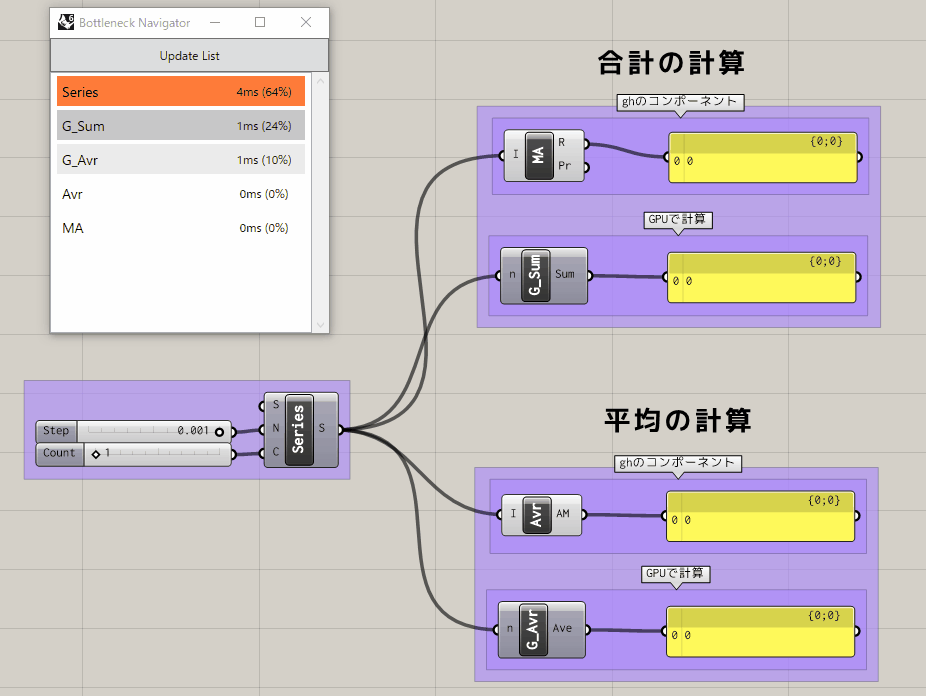

# GHGpuComputingTest

Test using CUDA with Alea GPU in grasshopper.

[Alea GPU](http://www.aleagpu.com/release/3_0_4/doc/)を使ってghでCUDAを使うテスト

## TestResult

Comparison between using the Sum and Average methods of the Alea GPU and using the components originally in gh.  
Sum is faster with Alea, but Average is not much different.

Alea GPUのSumメソッドとAverageメソッドを使った場合と、ghにもともとあるコンポーネントを使った場合の比較。  
SumはAleaを使った方が早く、Averageは大きく変わらない。

